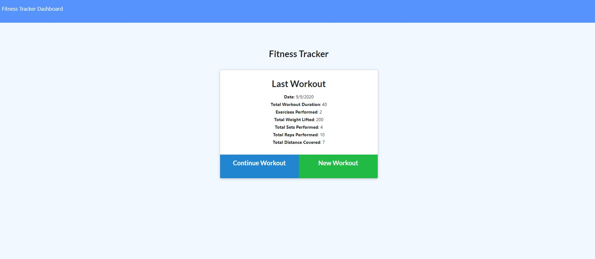

# Workout Tracker
## Description
  This application allows users to keep track of their workout.
## Table of Contents
1.[Usage](#Usage)

2.[Contribution](#Contribution)

3.[Questions](#Questions)

Image of the application

## Installation Requirements
    npm express
    npm mongoose
    npm morgan
## Usage
    Users who want to keep track of their workout routine.
## License

## Contribution
    Feel free to contact Ray's GitHub
## Heroku Deployed Link
   https://mysterious-sea-03484.herokuapp.com/
## Questions
If you have any questions, please contact my GitHub(https://github.com/rnguyen7388) or send me an email at rnguyen7388@gmail.com
